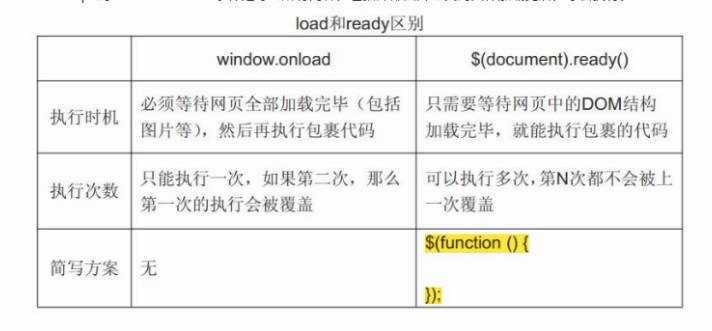

# JQuery学习笔记

jQuery是一个JavaScript函数库

1. jQuery引入：

   1. 浏览器兼容：IE选择器

      ```
      <body>
      //chrome firefox safari opera IE 9+
      	<!--[if gt IE 8] -->
      	<script src="../jquery-3.3.1.min.js"></script>
      	<!-- <![endif] -->
      //IE8及以下
      	<!--[if lte IE 8]>
      	<script src="../jquery-1.12.4.min.js"></script>
      	<!--[endif]-->
      </body>
      ```

2. JQuery入口函数：

   1. $(document).ready(function(){})；
   2. $(function(){});

3. JavaScript入口函数：

   1. window.onload=function(){}

   

4. jQuery选择器：所有选择器都以美元符号：$()
   1. [$(this).hide()](https://www.runoob.com/try/try.php?filename=tryjquery_hide_this)隐藏当前的 HTML 元素。
   2. [$("p").hide()](https://www.runoob.com/try/try.php?filename=tryjquery_hide_p)隐藏所有 <p> 元素。
   3. [$(".test").hide()](https://www.runoob.com/try/try.php?filename=tryjquery_hide_class)隐藏所有 class="test" 的元素。
   4. [$("#test").hide()](https://www.runoob.com/try/try.php?filename=tryjquery_hide_id)隐藏 id="test" 的元素。
   
5. $("[href]")选取带有href属性的元素。
   6. $(":button") 选取所有type="button"的<input>元素和<button>元素。
   7. $("tr:even")选取偶数位置的<tr>元素。
   8. $("tr:odd")选取奇数位置的<tr>元素。
   
5. JQuery hide()和show()用来隐藏和显示HTML元素

6. 使用toggle()方法来切换hide()和show()方法

   1. toggle(speed,callback)，可选speed参数规定隐藏/显示的速度，可以取以下值:"slow"、"fast"或毫秒。

   2. 可选callback参数是隐藏或显示完成后所执行的函数名称。

      1.$(*selector*)选中的元素的个数为n个，则callback函数会执行n次；

      2.callback函数名后加括号，会立刻执行函数体，只会调用一次，如果不加括号，要等到显示/隐藏完成后才执行，调用多次；

      3.callback既可以是函数名，也可以是匿名函数；

7. 淡入淡出方法: fadeIn() /fadeOut() / fadeToggle() / fadeTo()

   1. fadeIn()淡入:$(selector).fadeIn(speed,callback);
      1. speed参数规定效果的时长,callback参数是fadein完成后所执行的函数名称.
   2. fadeout()淡出:$(selector).fadeOut(speed,callback);
   3. fadeToggle()淡入淡出效果:$(*selector*).fadeToggle(speed,callback);
   4. fadeTo()允许渐变为给定的不透明度
      1. $(selector).fadeTo(speed,opacity,callback);

8. JQuery滑动

   1. slideDown()向下滑动元素
      1. $(selector).slideDown(speed,callback);
   2. slideup()向上滑动元素
      1. $(selector).slideUp(speed,callback);
   3. slideToggle()上下滑动
      1. $(selector).slideToggle(speed,callback);

9. JQuery动画

   1. $(selector).animate({params},speed,callback);

      1. 必需的 params 参数定义形成动画的 CSS 属性。
      2. 可选的 speed 参数规定效果的时长。它可以取以下值："slow"、"fast" 或毫秒。
      3. 可选的 callback 参数是动画完成后所执行的函数名称。

      ```
      $("button").click(function(){
        $("div").animate({left:'250px'});
      });
      ```

11. JQuery停止动画:stop()
    1. 用于停止动画或效果,在它们完成之前.
       1. $(selector).stop(stopAll,goToEnd);
       2. 可选的stopAll参数规定是否应该清除动画队列.默认是false,即仅停止活动的动画,允许任何排入队列的动画向后执行.
       3. 可选的goToEnd参数规定是否立即完成当前动画.默认是false
    2. 只停止当前正在进行的动画，停止当前动画后，队列中的下一个动画开始进行.可设置stopAll参数为true,这样就停止所有.

12. JQuery回调函数callback

    1. 被立即停止的动画不会触发回调，被立即完成的动画会触发回调。

13. jQuery方法链接

    1. $("#p1").css("color","red").slideUp(2000).slideDown(2000);

14. JQuery获取内容和属性

    1. text()-设置或返回所选元素的文本内容

    2. html()-设置或返回所选元素的内容(包括HTML标记)

    3. val()-设置或返回表单字段的值

    4. 获取属性和内容

       1. 固有属性用prop();
          1. 如果有相应的属性,返回指定属性值
          2. 如果没有对应的属性,返回值是空字符串
       2. 自定义属性用attr():$(selector).attr("href");
          1. 如果有相应的属性,返回指定属性值
          2. 如果没有相应的属性,返回值是undefined

    5. 设置内容和属性

       1. $("#test1").text("helllo world!");
       2. $("#test2").html("<b>hello world</b>");
       3. $("#test3").val("RUNOOB");

    6. 回调函数

       1. ```
          $("#btn1").click(function(){
              $("#test1").text(function(i,origText){
                  return "旧文本: " + origText + " 新文本: Hello world! (index: " + i + ")"; 
              });
          });
          ```

       2. ```
          //单个赋值
          $("button").click(function(){
          $("#runoob").attr("href","http://www.runoob.com/jquery");
          });
          //多个赋值
          $("button").click(function(){
              $("#runoob").attr({
                  "href" : "http://www.runoob.com/jquery",
                  "title" : "jQuery 教程"
              });
          });
          ```

       3. ```
          $("button").click(function(){
            $("#runoob").attr("href", function(i,origValue){
              return origValue + "/jquery"; 
            });
          });
          ```

15. JQuery添加元素

    1. append()在被选元素的结尾插入内容
    2. prepend()在被选元素的开头插入内容
    3. after()在被选元素之后插入内容
    4. before()在被选元素之前插入内容
    5. 区别
       1. append/prepend 是在选择元素内部嵌入。
       2. after/before 是在元素外面追加。

16. JQuery删除元素

    1. remove()删除被选元素及其子元素
       1. $("p").remove(".italic");删除class="italic"的所有p元素
    2. empty()从被选元素中删除子元素

17. JQuery 获取并设置CSS类

    1. addClass() 向被选元素添加一个或多个类
       1. addClass('c1 c2 ...' | function(i, c)) -- 添加一个或多个类。
    2. removeClass() 从被选元素删除一个或多个类
       1. removerClass('c1 c2 ...' | function(i, c)) -- 删除一个或多个类。
    3. toggleClass() 对被选元素进行添加/删除类的切换操作
       1. toggleClass('c1 c2 ...' | function(i, c), switch?) -- 切换一个或多个类的添加和删除。
    4. css()设置或返回样式属性
       1. css("backgroud-color");返回首个匹配元素的background-color值
          1. :nth-child()获取其他
          2. alert("p2背景颜色 = " + $("p:nth-child(3)").css("background-color"));
          3. PS: 这里 :nth-child() 选择器默认以 body 作为父标签。
       2. css("background-color");为所有匹配元素设置background-color值

18. JQuery width()和height()

    1. width()方法设置或返回元素的宽度(不包括内边距\边框或外边框)
    2. height()方法设置或返回元素的高度(不包括内边距\边框或外边距)

19. JQuery innerWidth()和innerHeight()

    1. innerWidth()方法返回元素的宽度(包括内边距)
    2. innerHeight()方法返回元素的高度(包括内边距)

20. JQuery outerWidth() 和outerHeight()

    1. outerWidth()方法返回元素的宽度(包括内边距和边框)
    2. outerHeight()方法返回元素的高度(包括内边距和边框)

21. JQuery遍历(父元素和祖先)

    1. parent()返回被选元素的直接父元素
    2. parents()返回被选元素的所有祖先元素,直到文档的根目录(<HTML>)
       1. parents("ul")选择所有祖先元素,并且它是<ul>元素
    3. parentsUntil("div")返回与<div>元素之间的所有祖先元素.

22. JQuery遍历(后代)

    1. children()方法:返回被选元素的所有直接子元素(下一级)
    2. find()方法:返回被选元素的后代元素,一路向下直到最后一个后代
       1.  $("div").find("span");div后代的所有span元素
       2. $("div").find("*");div的所有后代

23. JQuery遍历(同胞)

    1. siblings()方法:返回被选元素的所有同胞元素
    2. next()方法:返回被选元素的下一个同胞元素,只返回一个.
    3. nextAll()方法:返回被选元素的所有跟随的同胞元素
    4. nextUntil()方法:返回介于两个给定参数之间的所有跟随的同胞元素
    5. prev(),prevAll(),prevUntil()方法与上面方法类似,只是方向相反.

24. JQuery遍历(过滤)

    1. first()方法:$("div p").first();选取首个div元素内部的第一个p元素
    2. last()方法:  $("div p").last();选择最后一个div元素中的最后一个p元素
    3. eq()方法:  $("p").eq(1);索引号为1的p元素
    4. filter()方法:  $("p").filter(".url");返回带有类名"url"的所有p元素
    5. not()方法:与filter()相反
    6. 

